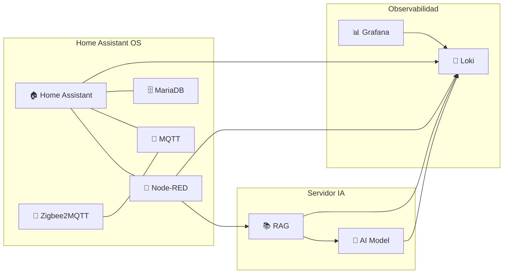

Objective
Deploy a new Local AI platform that will allow interact with my currently deployed Home assistant system. 

# Use Cases

## UC.1 Read Home Status
|Column | Description | components involved |
|--------------|---------------|-------------|
|UC.1-1| Check if there is any light turned on||
|UC.1-2| Turn own the temperature based on plan text and conditions ||

## UC.2 Manipulate Home Status

|Column | Description | components involved |
|--------------|---------------|-------------|
|UC.1-1| Switch on lights based on plan language| Local IA, N8N, home assistant|
|UC.1-2| Turn own the temperature based on plan text and conditions ||

## UC.3 Raise alarms in Home assistant based on complex circumstances

|Column | Description | components involved |
|--------------|--------------|--------------

# Restrictions
FOllowing are the restrictions that are modelling the project
|ID| Description|Impact|
|--------------|--------------|-----|
| RSTR.1| Currently I have a very stable Home assistant appliance running on a dedicated Home assistant OS NUC server. Because of this, deployed|All the Home assistant services like Node Red, Home assistant, Home assistant DB and  and other related systems will remain as Home assistant addons instead of dockerized components.
| RSTR.2 | For all the remaining dockerized components (Ollamas, Grafana, Loki), dockers will be deployed in WSL2, so in will be deployed on demand| These systems will not at the beginning 24x7, only available when running on the process
|RSTR.3 | For the AI model selection, initially will be run by local models using OLLAMA. after this is stable, a cloud enterprise level model (i.e: claude) may be used. | Slowlness is expected when asking something to IA

#Architecture

#Deployment
TBD
#Testing
TBD
References

https://github.com/JakeSteam/Mermaid